# Карта проекта

## Основные пакеты

### types
- **collections**: Содержит различные обобщенные структуры данных.
  - **[List](collections/list/README.md)**: Универсальный список.
    - Методы: `Add`, `Insert`, `Remove`, `Get`, `Size`, `IsEmpty`
    - Подтипы: `LinkedList`, `SkipList`
  - **[Queue](collections/queue/README.md)**: Универсальная очередь FIFO.
    - Методы: `Enqueue`, `Dequeue`, `Size`, `IsEmpty`
    - Подтипы: `Deque`, `PriorityQueue`, `RingBuffer`
  - **[Stack](collections/stack/README.md)**: Универсальный стек LIFO.
    - Методы: `Push`, `Pop`, `Peek`, `Size`, `IsEmpty`
  - **[Set](collections/set/README.md)**: Набор уникальных элементов.
    - Методы: `Add`, `Remove`, `Contains`, `Size`, `IsEmpty`
  - **[Dictionary](collections/dictionary/README.md)**: Универсальный словарь/карта.
    - Методы: `Set`, `Get`, `Remove`, `Contains`, `Size`, `IsEmpty`
    - Подтипы: `SortedDictionary`
  - **[Heap](collections/heap/README.md)**: Структура данных куча.
    - Методы: `Push`, `Pop`, `Peek`, `Size`, `IsEmpty`
  - **[Tree](collections/tree/README.md)**: Структуры данных деревьев.
    - Методы: `Insert`, `Delete`, `Search`, `Size`, `IsEmpty`
    - Подтипы: `BST`, `BTree`, `Trie`
  - **[Graph](collections/graph/README.md)**: Неориентированный граф.
    - Методы: `AddVertex`, `AddEdge`, `RemoveVertex`, `RemoveEdge`, `Size`, `IsEmpty`
  - **[DisjointSet](collections/disjointset/README.md)**: Система непересекающихся множеств.
    - Методы: `MakeSet`, `Union`, `FindRoot`, `Size`, `IsEmpty`
  - **[LRUCache](collections/lrucache/README.md)**: Кэш с наименьшим недавно использованным.
    - Методы: `Put`, `Get`, `Remove`, `Size`, `IsEmpty`
  - **[BitSet](collections/bitset/README.md)**: Битовое множество.
    - Методы: `Set`, `Get`, `Clear`, `Size`, `IsEmpty`
  - **[BloomFilter](collections/bloomfilter/README.md)**: Фильтр Блума.
    - Методы: `Add`, `Contains`, `Size`, `IsEmpty`
  - **[FenwickTree](collections/fenwicktree/README.md)**: Дерево Фенвика.
    - Методы: `Update`, `Query`, `Size`, `IsEmpty`
  - **[SegmentTree](collections/segmenttree/README.md)**: Дерево отрезков.
    - Методы: `Update`, `Query`, `Size`, `IsEmpty`
  - **[CircularList](collections/circularlist/README.md)**: Циклический список.
    - Методы: `Add`, `Remove`, `Size`, `IsEmpty`
  - **[ConcurrentMap](collections/concurrentmap/README.md)**: Конкурентная карта.
    - Методы: `Set`, `Get`, `Remove`, `Contains`, `Size`, `IsEmpty`
  - **[MultiMap](collections/multimap/README.md)**: Мультимап.
    - Методы: `Put`, `Get`, `Remove`, `Size`, `IsEmpty`
  - **[SortedSet](collections/sortedset/README.md)**: Отсортированное множество.
    - Методы: `Add`, `Remove`, `Contains`, `Size`, `IsEmpty`
  - **[Semaphore](collections/semaphore/README.md)**: Семафор.
    - Методы: `Acquire`, `Release`, `Size`, `IsEmpty`

- **[nullable](nullable/README.md)**: Обобщенный тип для обработки необязательных значений.
  - **Nullable Type**
    - Методы: `New`, `Get`, `IsNull`, `Set`, `Reset`

- **[cast](cast/README.md)**: Утилиты преобразования типов.
  - **Type Conversion Utilities**
    - Методы: `ToString`, `ToInt`, `ToFloat`, `ToBool`, `ToSlice`, `ToMap`

- **[sort](sort/README.md)**: Обобщенные помощники сортировки.
  - **Sorting Helpers**
    - Методы: `Slice`, `Sort`, `StableSort`, `Reverse`

- **[context](context/README.md)**: Утилиты для управления жизненным циклом и внедрения зависимостей.
  - **Dependency Injection**
    - Методы: `Register`, `Resolve`, `Build`, `Dispose`

- **[channel](channel/README.md)**: Обобщенная реализация канала.
  - **Generic Channel**
    - Методы: `Send`, `Receive`, `Close`, `IsClosed`

- **[signal](signal/README.md)**: Обобщенные механизмы сигнализации.
  - **Signaling Mechanisms**
    - Методы: `Subscribe`, `Unsubscribe`, `Emit`, `Broadcast`

- **internal**: Общие утилиты.
  - **Vector**: Потокобезопасный вектор.
    - Методы: (не указаны, но включают базовые операции с вектором)

## Диаграмма Mermaid

```mermaid
graph TD
    A[types] --> B[collections]
    A --> C[nullable]
    A --> D[cast]
    A --> E[sort]
    A --> F[context]
    A --> G[channel]
    A --> H[signal]
    A --> I[internal]

    B --> B1[List]
    B --> B2[Queue]
    B --> B3[Stack]
    B --> B4[Set]
    B --> B5[Dictionary]
    B --> B6[Heap]
    B --> B7[Tree]
    B --> B8[Graph]
    B --> B9[DisjointSet]
    B --> B10[LRUCache]
    B --> B11[BitSet]
    B --> B12[BloomFilter]
    B --> B13[FenwickTree]
    B --> B14[SegmentTree]
    B --> B15[CircularList]
    B --> B16[ConcurrentMap]
    B --> B17[MultiMap]
    B --> B18[SortedSet]
    B --> B19[Semaphore]

    B1 --> B1a[LinkedList]
    B1 --> B1b[SkipList]

    B2 --> B2a[Deque]
    B2 --> B2b[PriorityQueue]
    B2 --> B2c[RingBuffer]

    B5 --> B5a[SortedDictionary]

    B7 --> B7a[BST]
    B7 --> B7b[BTree]
    B7 --> B7c[Trie]

    I --> I1[Vector]

    C --> C1[Nullable Type]
    D --> D1[Type Conversion Utilities]
    E --> E1[Sorting Helpers]
    F --> F1[Dependency Injection]
    G --> G1[Generic Channel]
    H --> H1[Signaling Mechanisms]

    C1 --> C1m[Methods: New, Get, IsNull, Set, Reset]
    D1 --> D1m[Methods: ToString, ToInt, ToFloat, ToBool, ToSlice, ToMap]
    E1 --> E1m[Methods: Slice, Sort, StableSort, Reverse]
    F1 --> F1m[Methods: Register, Resolve, Build, Dispose]
    G1 --> G1m[Methods: Send, Receive, Close, IsClosed]
    H1 --> H1m[Methods: Subscribe, Unsubscribe, Emit, Broadcast]
    B1 --> B1m[Methods: Add, Insert, Remove, Get, Size, IsEmpty]
    B2 --> B2m[Methods: Enqueue, Dequeue, Size, IsEmpty]
    B3 --> B3m[Methods: Push, Pop, Peek, Size, IsEmpty]
    B4 --> B4m[Methods: Add, Remove, Contains, Size, IsEmpty]
    B5 --> B5m[Methods: Set, Get, Remove, Contains, Size, IsEmpty]
    B6 --> B6m[Methods: Push, Pop, Peek, Size, IsEmpty]
    B7 --> B7m[Methods: Insert, Delete, Search, Size, IsEmpty]
    B8 --> B8m[Methods: AddVertex, AddEdge, RemoveVertex, RemoveEdge, Size, IsEmpty]
    B9 --> B9m[Methods: MakeSet, Union, FindRoot, Size, IsEmpty]
    B10 --> B10m[Methods: Put, Get, Remove, Size, IsEmpty]
    B11 --> B11m[Methods: Set, Get, Clear, Size, IsEmpty]
    B12 --> B12m[Methods: Add, Contains, Size, IsEmpty]
    B13 --> B13m[Methods: Update, Query, Size, IsEmpty]
    B14 --> B14m[Methods: Update, Query, Size, IsEmpty]
    B15 --> B15m[Methods: Add, Remove, Size, IsEmpty]
    B16 --> B16m[Methods: Set, Get, Remove, Contains, Size, IsEmpty]
    B17 --> B17m[Methods: Put, Get, Remove, Size, IsEmpty]
    B18 --> B18m[Methods: Add, Remove, Contains, Size, IsEmpty]
    B19 --> B19m[Methods: Acquire, Release, Size, IsEmpty]
```

